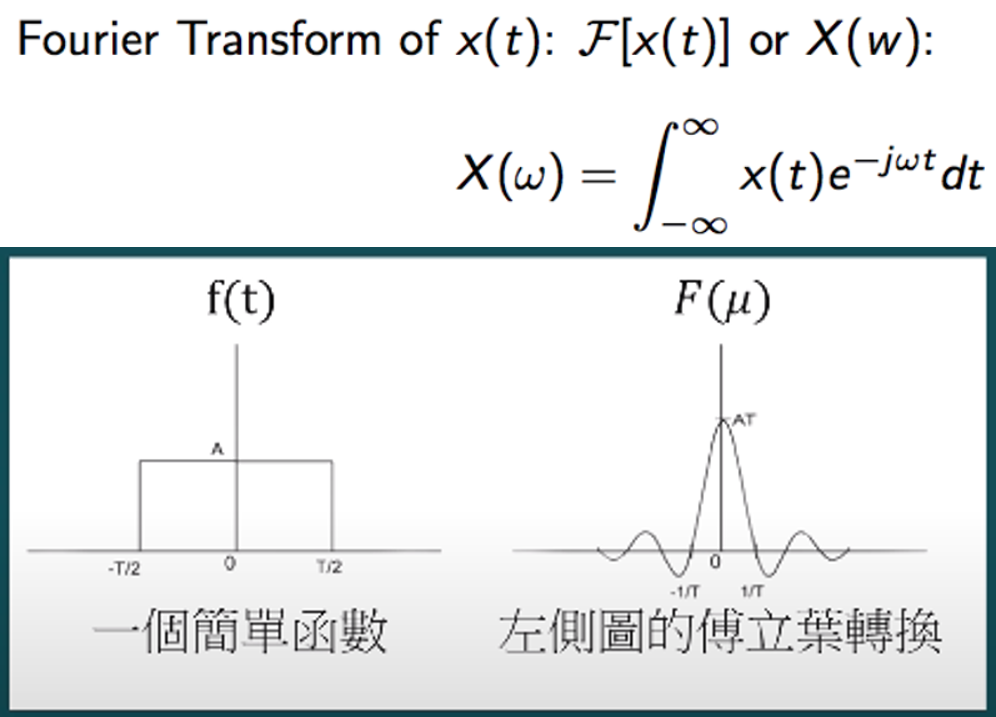
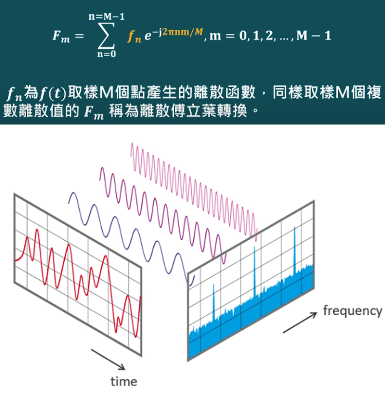
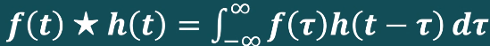
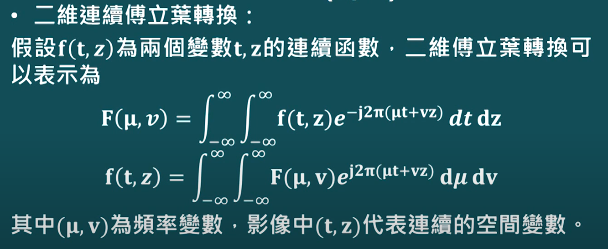
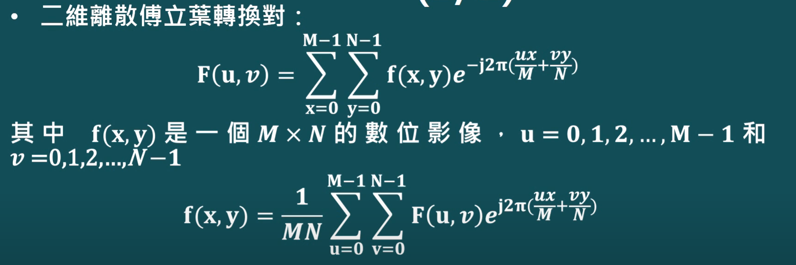
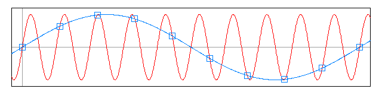
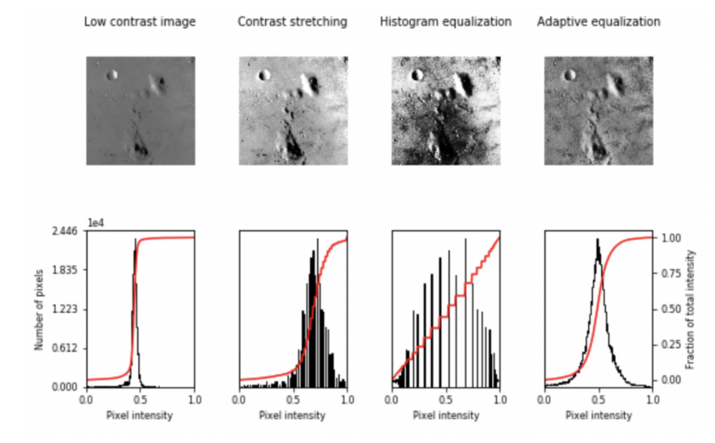
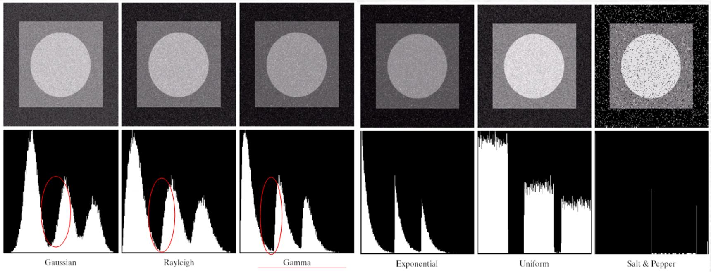

## Usful website
[ISP图像处理流程及各块名词解释](https://zhuanlan.zhihu.com/p/165476173)
# OCW
## 數位影像處理

### 定義
- 影像：二維函數 f(x,y), xy 為空間座標, 函數大小為該點的強度(intensity)或灰階(gray level)
- 數位影像：當影像的空間座標x, y以及數值 f(x,y)皆是有限的離散值時稱為數位影像
- 每個影像元素 (不同的位置、值) 稱為 pixel
- 數位影像處理
    - 藉由電腦處理數位影像
    - 低階處理：減少雜訊，增強對比度，影像銳利化 (輸入輸出皆為影像)
    - 中階處理：影像分割，物件描述，物件分類等（輸入影像，但輸出不一定為影響）
    - 高階處理：執行與視覺相關的認知功能
    - 影像處理著重在低階以及中階處理

### 光源與電磁頻譜
- 波長 (lambda)  = 頻率 (v) / 光速 (C)
- 能量 (E) = 普郎克常數 (h) x 頻率 (v)
- 人類對光的感知
    - 單色光
        - Intensity 
        - Gray Level
    - 彩色光
        - Radiance (光輝)：從光源流出的總能量，單位為瓦(W)
        - Luminance (亮度)：感受光源能量大的衡量，單位為流明(lm)
            - 不可見光可能有大 radiance, 但 luminance 為 0
            - 同樣的 radiance 下，Luminance 綠＞紅＞藍
        - Brightness (光亮)：對光的感受的主觀描述，不可測量
    - Mach band 馬赫帶：當觀察兩塊亮度不同的區域時，邊界處亮度對比加強（比實際強），使輪廓表現得特別明顯。from edge enhancement due to lateral inhibition of the retina
- 常見的光源種類
    - 鹵素燈，金屬燈泡，螢光燈，LED燈，雷射光

### 影像感應與擷取
- 專有名詞
    - FoV 視野範圍
    - Resolution 解析度
    - Working Distance 工作距離
    - DoF 景深
- 3D 成像
    - 兩個以上相機，用特徵點重建深度（適合有特徵點的）
    - 投射光斑，利用兩個相機重建深度（適合平滑）

### 影像取樣與量化
- 連續影像至數位影像
    - 取樣 (sampling)
    - 量化 (quantization)
    - 連續影像 f(s,t) -> 數位影像 f(x,y) [f(0,0)->f(M-1,N-1)]
- 數位影像儲存大小
    - 設影像高寬 M*N, 每 pixel 用 k bit
    - 需花 b = M * N * k (or N^2*k if M=N)
- 解析度
    - 空間解析度
        - dpi - dots per inch 
        - 放大會有 blocking effect
    - 強度解析度
        - 不夠會有 false contouring
- Interpolation (影像內插)
    - 方法: Nearest Neighbor, Bilinear, Bicubic Interpolation
        - Bicubic: 最近的十六個採樣點的加權平均得到
    - 應用：縮放(Scaling)/旋轉(Rotation)/捲曲(Warping)/變形(Morphing)

### 像素間之基本關係
- Neighbors 關係
    - N_4(p) 4-鄰接姓
    - N_8(p) 8-鄰接性

### 數位影像處理相關數學公式
- 線性代數
    - 單一像素運算 s=T(r)
    - 鄰域運算 g(x,y) = C*f(x,y)
        - 以任意點 (x,y) 為中心且大小為 mxn 之 window 做運算
    - Affine Transform 
        - pixel 移到新位置時用內插法給予值（Affine Transform 算出來可能是小數點）
        - 只要 4 組 pair ( 8 個方程式就可以定義一組 Affine Transform)
- 機率
    - p(z_k): 灰階值 k 出現機率  
    - 根據機率可以得到 mean, variance
    - 可用在影像強化上 (如使用 Histogram Equalization, OSTU 用一門檻分前景背景)

## Spatial Domain 空間域
- 某些問題在適合在 spatial domain 解決，如對比度增強
- 灰階影像：f(x,y), x, y為空間位置, f(x,y)的值大小稱為影像在該點的 intensity (強度), 每個影像元素有特定的位置與值，稱為 pixel (像素)
    - 通常最小表示黑色，最大表示白色, 如 8-bit 0代表黑色 255代表白色
- 數位影像：Analog Image -> Digital Sampling（解析度） -> Pixel Quantization（色彩品質）
- 彩色影像：f(x,y,i) 大小代表在某點 (x,y) 的色彩強度值 (i={r,g,b})
- 一個 24 位元的彩色影像, 色彩組合有 (2^8)x(2^8)x(2^8) or 2^24 個色彩組合 
- 色彩深度：表示每儲存1像素的顏色所用的位元樹木，稱為 bit-per-pixel, bpp
    - 1 bpp-> 0/1 半色調影像, 8 bpp -> 灰階, 24 bpp-> RGB各8位元, 32 bpp-> RGBA 多表示透明
- 灰階影像看成 二維矩陣，彩色影像看成 3 個二維矩陣
- 影像放大：Upsampling, Bilinear Interpolation 
    - 考慮 1D: f(n+a) = (1-a)f(n) + (a)f(n+1) for 0 <= a <= 1
    - 2D 先插出 2個水平1D，再用2個水平1D插出最後結果 
- Intensity Transformation 強度轉換
    - 目的：調整一張輸入影像個每個像素，透過 Intensity Transformation 對象素值做調整（如對比度強化，二值化等等）
    - s = T(r), r is origin pixel value, s is pixel value after transformation 
    - **Negative Transform**: s = T(r) = 255-r
    - **Log Transformation** s = T(r) = log(1+r) [避免 log (0)]
        - 對顯示器而言，表現最暗，最亮對比度階層有限，但例如 Fourier Spectrum 輸出範圍 0~1.5e^6 會被大值 donimate 導致圖大多為黑色，可用 log transformation 後可看到更多細節
    - **Histogram equalization**
        - 根據輸入圖片的直方圖計算強度轉換函數
        - 對比度強化的特性：A>=B->f(A)>=f(B)，多對一，可能有些灰階cnt=0
        - 演算法步驟：計算 pmf or imgHist -> 計算 cdf -> 計算轉換函數 s = T(r)
        
- Spatial Domain Example
    - g(x,y) = T[f(x,y)]
    - T 常用 x,y 之鄰近區塊，且採用 Sliding Window, 稱為 mask/filter/kernel 
        - 做 weighted sum of dot product, 稱為 correlation [w(s,t)f(x+s,y+t)]
        - convolution [w(s,t)f(x-s,y-t)] 
        - 3x3 mean filter: 都 1/9, Gaussian Filter 中間 1/4 上下左右 1/8 對角 1/16  

## Frequency Domain
- 某些問題在適合在 frequency domain 解決，如紋理分析的問題
- 正弦波 Asin(w theta) 和 餘弦波 Acos(w theta)
    - A=1, W=1 震盪在 -1~1 週期 2pi
    - 若A變大，震幅變大，w變大，頻率變快
- 傅立葉級數：任何**週期性函數**都可表示成不同 sin 及 cos 之和
    - 週期性函數：可找到固定循環的週期T
    - 疊加越多正弦波可逼近方波
- 傅立葉轉換：任何**非週期性函數**可藉由一個加權函數來表達 sin 及 cos 相乘的積分和
    - 非週期性函數：找不到固定循環的週期T
    - **Fourier transform** 
    
    - **Discrete fourier transform**
    
    - Fast Fourier Transform (將運算分離 O(N^2)->O(NlogN))
- Convolution 
    - 定義
    
    - 在 frequency domain 相乘 = spatial domain convolve [f(t)*h(t)<->H(u)F(u)]
    - 在 frequency domain convolve = spatial domain 相乘 [f(t)h(t)<->H(u)*F(u)]
- 2D Fourier Transform
    - Continuous
    
    - Discrete
    
    - 性質
    - 數位影像經過傅立葉轉換後，低頻對應到能量最強的部份（影像輪廓）
        - 可用來平滑
        - 可用來壓縮影像（只要保留能量強的）
    - 高頻對應到變動劇烈，（影像細節）
        - 可用來銳化（原始+高通後圖片）

### Low pass filter 通常解決雜訊 (smooth)
- Ideal -> ringing effect (cliff)
- Butterworth -> reduce ringing effect (n調整衰減幅度)
- Gaussain -> 最常使用 （衰減幅度慢or高頻保留越多則細節更多）
- Ideal 難以在現實電路實踐，Gaussain 容易實踐
### High pass filter 通常用來影像銳化 (sharpen)
- 高通 = 1-低通
- Ideal -> ringing effect (cliff)
- Butterworth -> reduce ringing effect (n調整衰減幅度)
- Gaussain -> 最常使用 （衰減幅度慢or高頻保留越多則細節更多）
- Ideal 難以在現實電路實踐，Gaussain 容易實踐
### Selective filtering 
- 帶通/帶拒 通常用來移除特定頻率的 noise (如衛星影像)
### Laplaican 拉普拉斯
- 相當於2次微分 類似於 high pass
- 相較於 high pass 背景保留較多，邊緣變強烈
### Homomorphic filtering
- f(x,y) = i(x,y)r(x,y) i照度，r反射係數
- 個別做 fourier transform 以及濾波 
- 結果：強度壓縮同時對比度增強 (黑得更黑，白得更白)

### Noise Reduction
- Spatial domain
    - Mean filter v.s. Median filter
        - Gaussian Noise 
            - Mean filter (適合平均 noise)，邊緣平滑
            - Medain fileter 沒用
        - Salt and papper noise 
            - Mean filter 有減輕，但邊緣平滑 
            - Median filter有用 (適合極值)
        - 頻率域干擾 -> Mean Median 都不太有效 (空間域都不太有效)
    - Laplacian (2次微分) v.s. Sobel (一次微分，分別對 x, y 再相加)
        - Gaussian Noise 與 Salt and papper noise 
            - Laplacian 強化雜訊
            - Sobel 強化雜訊更明顯 (1次微分受到影響更強)
        - 頻率域干擾 
            - 都沒啥用，還稍微加強，Sobel 加強更多
        - 影像銳化通常用 Laplacian 比較少受到 noise 干擾，sobel 過度強化noise
- Frequency domain
    - Ideal lowpass v.s. Gaussian lowpass 
        - Salt and papper noise and Gaussian Noise 
            - Ideal: ringing effect, like mean filter
            - Gaussian: without ringing effect, like mean filter
        - 頻率域干擾
            - both work, but ideal lowpass will have ringing effect
    
## Color Space
- 色彩特徵
    - 亮度(brightness) 色調(hue) 飽和度(saturation)
- 色彩模型 (color model) 皆是硬體導向或應用導向
    - 常用的硬體導向
        - RGB (顯示器，攝影機)：直角坐標系統
            - 安全RGB 256色，40個給作業系統 216色為標準色彩
            - 每一個值只能是 0,51,102,153,204,255
        - CMY/CMYK (印刷)
            - RGB to CMY (C=1-R, M=1-G,Y=1-B,K代表黑色)
        - HSI (解釋色彩 色調/飽和/強度)
            - 可用三角形或圓形表示
            - 色調(Hue) 飽和度(saturation) 強度(Intensity)
            - Hue: 描述純色彩
            - Saturation: 色彩混和白光的程度
            - 灰階視為z軸，一平面包含目標色彩點且與灰皆軸垂直
                - 交點為亮度
                - S向量指向目標點，向量大小即為飽和度
                - S向量與紅色軸的夾角即為色調
- 全彩影像處理
    - 色彩轉換：理論上任何轉換再任何模型上執行，但在某些空間可能運算可以減少
        - 例如轉換強度，在HSI只要轉I，在RGB三個都要轉
    - 補色：色彩圓上相對的色調，補色在增強彩色影像較暗區域的細節上有用
    - 色調修正
        - 低強度：整體調高（類似 log function 形狀)
        - 高強度：整體調低（類似 exp function 形狀）
        - 中強度：強度高的像素調得更高，低的調更低可得到高對比 (類似sigmoid形狀)
        - 加強色彩的方法 (1) 減少互補色採 (2) 提高或減少相鄰色彩比例
            - 如對黑色加重/變弱 (互補色加重有類似減輕的效果)
    - 平滑化與銳化
        - 在 RGB 與 HSI 得到相似的結果，但 HSI 可以只調整強度，色調飽和度不影響
    - 雜訊
        - RGB 中一個通道受到雜訊影響，HSI會影響到所有成分影像（因為HSI的計算利用到所有RGB成分）

# IP/CV
## Digital Image Fundamentals
### Aliasing
- 發生在 sample rate 不夠高的時候
- causes different signals to become indistinguishable (or aliases of one another) when sampled. It also often refers to the distortion or artifact that results when a signal reconstructed from samples is different from the original continuous signal.

- Aliasing effect
    - 當用頻率Fs對一個更高頻率的信號f進行採樣時，高頻信號中Fs / 2以上的頻率信號並不會自動消失，而是對稱地映射到Fs / 2以下的頻譜中，和 的Fs / 2以下的頻率成分重疊起來，表現出實際場景中並不存在的模式，這種模式稱為偽影（artifact）

### Zooming and Shrinking
- Nearest Neigbor interpolation
    - 4 neighbors for horizonail and vertical ()
    - 4 neighbors for diagonal
- Pixel replication
- Bilinear Interpolation

### Histogram Equalization
Histogram灰階影像的直方圖，可以推論出影像大致上的特性。
-   較暗的影像灰階值聚集在數值低的區域，
-   整體亮的或曝光過度的灰階值聚集在數值高的區域，對比均衡灰階值平均分散於所有範圍。
  
可以發現 Adaptive Equalization(適應性等化)讓圖片的品質更好，有點像高斯分佈。

### Neighborhood Processing
- Corrlation/Convolution

### Blur
- local mean: all pixels belonging to the structuring element to compute average gray level.
- percentile mean: only use values between percentiles p0 and p1 (here 10% and 90%).
- bilateral mean: only use pixels of the structuring element having a gray level situated inside g-s0 and g+s1 (here g-500 and g+500)

Percentile and usual mean give here similar results, these filters smooth the complete image (background and details). Bilateral mean exhibits a high filtering rate for continuous area (i.e. background) while higher image frequencies remain untouched.

### Binarization (二值化)
將 0-255 變成 0-1
-   可用 threshold, local threshold, OTSU 等演算法

  

### Edge detection
- Sobel Filter
- Canny Edge

### Morphology (形態學)
- Dilation 膨脹
- Erosion 侵蝕

## Image Enhancement
- 可分為兩類 spatial domain and frequency domain methods
    - g(x,y), = T[f(x,y)]
    - f(x,y) 代表 image plane 上的值 (spatial domain), T is operator on f
    - neighbor size -> mask/kernel/template/window
- Gray-Level Transformation
    - Contrast stretching
    - Thresholding
    - Image negatives
    - Log Transformation
    - Power-law transformation
    - Gamma correction
    - Piece-wise Linear Transformation

- Histogram-Processing
    - Normalized histogram
    - Historgram Equalization (將原本的histogram分布變成 uniform)
    - Histogram Matching (變成別的分布)

- Spatial Filtering
    - mask/convolution kernels, odd sizes
    - corrleation 
    - Smoothing
        - linear filter (box filter, weighted average)
        - Order-statistics filter (median filter, max filter, min filter)
        - Laplacian
        - Bilateral filter

- Frequency Domain
    - 頻率就是信號變化的快慢，也就是圖像的梯度變化
        - 整面牆壁圖像 -> Intensity 變化不大，低頻較強高頻較弱（週期波主峰再0位置）
        - 棋盤圖像 -> Intensity 變化快速，高頻較強低頻較弱 （週期波多個旁峰偏離0)
        - 低頻：強度，高頻：邊緣輪廓
    - Fourier Transform 
        - 流程： f(x,y)->fourier transform get F(u,v) -> H(u,v)F(u,v) -> inverse fourier transform g(x,y)
        - 在 frequency domain 相乘 = 在 spatial domain convolve 
    - Noise Reduction (移除高頻率，Lowpass filter)
        - Notch filter 
        - Ideal lowpass, Butterworth, Gaussian
        - Ringing effect (斜率無窮大)
    - [Sharpen](https://zhuanlan.zhihu.com/p/98979968) (增強高頻率, Highpass filter)
        - In general, H_hp = 1-H_lp
        - Ideal highpass , Butterworth highpass, Gaussain highpass, Laplacian
        - Homomorphisc filter (non-linear)
        - 由於光學系統中鏡頭和抗混疊濾波器的低通濾波作用，傳感器捕捉到的圖像紋理細節會有所損失，即因為減小圖像重疊的圖像。圖像銳化是使圖像中的紋理邊緣更清晰的 一種圖像處理方法，常用的做法是提取圖像的中間分量，根據需要乘以一定的係數（即強度），然後將其疊加到原圖上。
        - 一般圖像中都會存在亮度和和較弱的邊緣，在下圖的示例中，由黑白線條組成的圖案亮度很強，而文字“ ISO 12233”部分則相對較弱。目前主流的ISP都支持對這 兩種紋理加壓不同的銳化係數（強度），可以使兩種紋理都能得到最佳的銳化效果，相反如果整幅圖像只用一個係數則難免顧顧此失彼。 圖像的方差。方差預期意味著紋理越強。
        - 銳化過度帶來的一個問題就是振鈴效應，英語是振鈴效應。振鈴效應一般發生在信號的高頻部分，如下圖所示。反映在圖像上就是黑白跳變 的邊緣處。
        - 從頻率的角度看，理想的方波可以看為無窮多個正弦信號重疊放置。振鈴效應形成的原因是方波中的一部分高頻信號的被低通濾波器截斷，剩餘的信號重疊起來 就變成下圖所示的樣子。

## Image Restoration
- Goal: improve an image in some predefined sense
    - Image enhancement: subjective process
    - Image restoration: objective process
    - Restoration attempts to reconstruct an image that has been degraded by using a priori knowledge of the degradation process.
    - Modeling the degradation and applying the inverse
process to recover the original image.
- Model of degradation
    - g(x,y) = h(x,y)*f(x,y)+n(x,y) (star is the convolve operator)
    - or G(u,v) = H(u,v)F(u,v)+N(u,v) in frequency domain
- Noise model
    - Gaussian noise (electronic circuit sensor noise)
    - Rayleigh noise (range imaging)
    - Gamma noise (laser image)
    - Exponentila noise (laser image)
    - Uniform noise
    - Impulse of salt-and-pepper noise (faulty switching)
    - Periodic noise
- Estimation of Noise Parameters
    - Periodic noises: from Fourier spectrum
    - Other: try to compute mean and variance of a subimage S
        - 如用某塊相同灰階來計算 noise
    - 要先對 noise 有一定了解才有辦法 denoise
- Mean filters:
    - Arithmetic mean / Geometric mean / Harmonic mean / Contaharmonic mean
- Order-Statistic filters
    - Median / Min / Max / Midpoint / Alpha-trimmed mean
- Adaptive filters
    - Filter's behavior changes based on statistical characteristics inside the filter window
    - Adaptive local noise reduction filter
    - Adaptive median filter
- Periodic Noise Reduction
    - Fourier domain filtering
        - Bandreject filter
        - Bandpass filter
        - Notch filter (Ideal, Butterworth, Gaussian)
- Linear, Position-Invariant Degradations
    - Estimating the degradation function
        - By image observation, experimentation, and modeling
- Deconvolution
    - Inverse filtering
    - Minimum mean square error filtering (Wiener)
    - Constrained least squares filtering
    - Geometric mean filter

## Image Segmentation
- 目標：切多個區域，每個區域內的 Property 相似
- 通常 Image segmentation algorithms base on **discontinuity** (e.g., edges) and **similarity** (e.g., thresholding, region growing etc)

- Detection of discontinuities
    - Point detection, Line detection, Edge detection 
    - 一次微分 highpass 沒變化微分完為0，二次微分看正/負（開始/結束）
    - 先用 low-pass 消除 noise 再用 high-pass 找 edge (high-pass 會增強 noise)
    - 定義 edge point 為一次微分後大於某 threshold 的 point
    - 將 edge point 連接可得 edge
    - Sobel, The Laplacian (**Zero-crossings**) 
    - 先做 Gaussian 再做 Laplacian
- Edge linking
    - 將 edge point 相連（Gradient / Magnitude 相似視為同 edge）
    - Hough Transform (將線段用 parametric space 表示, polar coordinate)
    - Graphic-Theoretic Techniques
        - Minimal-cost path
- Thresholding
- Region-Based Segmentation
    - Region Growing
    - Region-Splitting and Merging
    - Morphological Watersheds
- Motion-based Segmentation

## 影像處理大致上可分為7個步驟
- 1.擷取影像(acquiring the image):可能從相機來或電子顯微鏡。
- 2.前置處理(preprocessing):將影像處理程適合接下來步驟的樣子。
- 3.切割(segmentation):例如擷取車牌號碼
- 4.表示與描述(representation and description):尋找曲線或corner來辨識車牌數字
- 5.辨識與解讀(recognition and interpretation):給物體不同標示與意義，例如是那個縣市的車

數位影像的類型有四種：
- 1.Binary:二元影像非黑即白，每個像素只佔1位元。適合文字、指紋等。
- 2.Gray-scale:灰階影像從0(黑)~255(白)，每個像素8位元。
- 3.RGB:由紅藍綠調配深淺從0~255，有255的三次方需要用24-bit又稱24位元彩色影像。
- 4.Indexed:大部分影像都只用到1600萬種可能顏色的一小部分。為了方便儲存及處理於是建立色譜(color map)或調色盤(color palette)。每個像素的值不代表像素的顏色，是代表色譜上對應顏色的索引(index) ex:GIF檔
