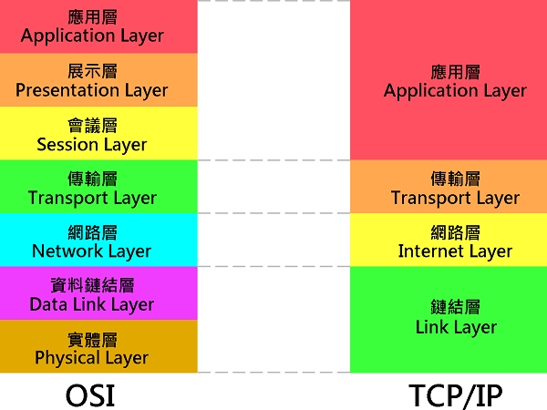

## OSI Model and TCP/IP Model
  

## Link Layer
- 例如乙太網路、Wi-Fi、MPLS等。

## Internet Layer
- IP

## Transport Layer
- 例如TCP、UDP、RTP、SCTP

## Application Layer
- 例如HTTP、FTP、DNS
- 該層包括所有和應用程式協同工作，利用基礎網路交換應用程式專用的資料的協定。 應用層是大多數普通與網路相關的程式為了通過網路與其他程式通訊所使用的層。這個層的處理過程是應用特有的；資料從網路相關的程式以這種應用內部使用的格式進行傳送，然後被編碼成標準協定的格式。
- 一些特定的程式被認為執行在這個層上。它們提供服務直接支援用戶應用。這些程式和它們對應的協定包括 HTTP（全球資訊網服務）、FTP（檔案傳輸）、SMTP（電子郵件）、SSH（安全遠端登錄）、DNS（網域名稱 <-> IP位址尋找）以及許多其他協定。 一旦從應用程式來的資料被編碼成一個標準的應用層協定，它將被傳送到IP棧的下一層。

https://www.youtube.com/watch?v=3QhU9jd03a0&t=144s&ab_channel=CrashCourse
## 專有名詞
- LAN (Local Area Network)
    - 小可至兩台電腦，大可至整校園
    - 目前標準為 Ethernet (乙太網路)
    - 最簡單的 LAN 多台電腦共用同一條 Ethernet
    - 傳遞資訊時，LAN 所有電腦都可以看到
        - 為了區別給誰看，每台電腦都有自己獨特的 MAC (Media Access Control) address
        - 傳遞資料時，傳遞 [dst|data]，每台電腦只需要處理傳遞到自己的資料（check header file)
        - MAC address 在 Ethernet 與 WiFi 中有用到
    - 傳遞資料時，有可能會與其他電腦同時競爭 Ethernet，稱為 Collision
        - LAN 多使用 CSMA/CD 協定 (Carrier Sense Multiple Access with Collision Detection) 
            - 訊號採用廣播的方式傳送（所以才會發生碰撞）
            - 當節點要發送訊號時，會先偵測通道是否有其他節點正在使用（carrier sense）
            - 當通道沒有被其他節點使用時，就傳送封包
            - 封包傳送之後立即檢查是否發生碰撞（carrier detection），若是發生碰撞則對通道發出高頻訊號高知其他節點已經發生碰撞
            - 碰撞後隨機等待一段時間重新發送封包 
            - 每次等待時間加長 Exponential backoff 如 1,2,4,8 + random
            - 嘗試 15 次都失敗的話則告知上層 Timeout
        - WiFi 多使用 CSMA/CA 協定 (Carrier Sense Multiple Access with Collision Avoidance)
            - 訊號採用廣播的方式傳送（非常容易受到無線電波干擾）
            - 當節點要發送訊號時偵測頻道是否空閒
            - 若是空閒則等待 IFS (Interval Frame Space) 時間後再次偵測頻道是否空閒
            - 若是空閒則發送封包，反之重新進入等待頻道空閒（隨機等待時間）
            - 發送 RTS 之後必須在限定時間內收到來至目的端的 CTS 訊號
            - 當失敗 32 次之後通知上層 Timeout
    - Bandwidth: the rate at which a carrier can transmit data 
        - carrier: wire for Ethernet, air for WiFi 
    - 儘管有 Collision Detection，但還是要盡量減少 Collision Domain 大小(#computer share the carrier)
        - 可以使用 Network Switch 來切割 Collision Domain 
        - 注意 Hub (集線器) 只有廣播及分派虛擬 IP 功能，並不能切割 Collision Domain 
        - Switch (交換器) 會記錄封包中的MAC位址所以當電腦A傳送資料給電腦B時，其他電腦並不會也收到資料，而且這個時候別的電腦也可以同時互相傳送資料。

- Routing
    - Circulit Switching: establish a dedicated communications channel 
        - 在兩個通訊的端點之間建立實體線路連線。一旦建立兩端之間的連線後， 佔用線路並傳輸資料(即他人無法使用)。直到通信結束之後，這條專用路徑才停止使用。
        - 特色：在傳輸過程中，傳輸線路不能分享給其它節點(node)使用，即頻寬不共用。
        - 優點：傳輸速度快延遲小。不會產生線路衝突，錯誤率低。
        - 缺點：(inflexible and expansive)  需花時建立線路連線。 因需等待傳輸完成才會釋放線路，容易形成 佔線而浪費資源。
        - 常見在銀行及軍隊
    - Message Switching
        - 可視線路的忙碌狀況選擇不同的路徑來傳送資料(包含來源及目的) 
        - 優點： 每個節點都會檢查資料是否完整，可降低傳 輸的錯誤率。 整體線路的使用率提升。
        - 缺點： 當傳輸的資料量龐大時，會長時間佔用所選 擇的傳輸路徑，造成該段線路出現壅塞情形。   
        - More reliable and fault-tolerant 
        - **hop count**: #hops a message take
    - Packet Switching 
        - 先將欲傳遞的訊息**分割成許多大小固定的小封包 (Packets)**，其中包含目的地的「位址」，傳送至目的地後重新組合。網際網路通訊、數據和語音通訊中最重要的基礎。
        - 每個封包路徑可能不同
        - 由 Network router 來平衡不同路徑的負擔 ([congestion control](https://notfalse.net/28/tcp-congestion-control))
        - Internet Control Message Protocol ([ICMP](https://www.netadmin.com.tw/netadmin/zh-tw/technology/111381F2995A4AB48672E965F63133AE)), Border Gateway Protocol (BGP)
        - 優點： 封包資料量小，傳輸快速可避免壅塞，具有 Message Switching與Circuit Switching 技術的優點。no single point of failure`(當初為了核戰設計的)
        - 缺點： 封包不會計算所有路徑的節點(node)，只管傳遞給下一個節點，故不會按順序送達，接收端需花時間重整資料。

- IP (Internet Protocol)
    - 每一連結到網路的電腦都有一 IP address (IPv4, IPv6)

- 網域名稱系統（DNS,Domain Name System）
    - 一般人使用網址名稱(Domain Name)來連接網路主要是為了方便人類記憶，可以從Domain Name猜出可能是什麼單位，或是網站大致內容。
    - DNS最主要的功能是將造訪的網站域名轉成難記的IP位置，因為電腦只看得懂數字，所以需要透過DNS Server進行查詢，查到和電腦溝通的一連串數字(IP Address)，並回傳給電腦。
    - 打個比方，今天小明要撥電話給小華，小明不可能只對電話呼叫對方名字就撥通電話，而是撥小華的電話號碼(同IP Address)，撥出電話後，配對撥出的號碼，才能找到小華(域名)這個人。
    
